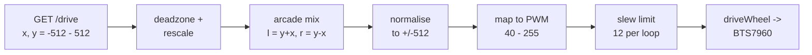
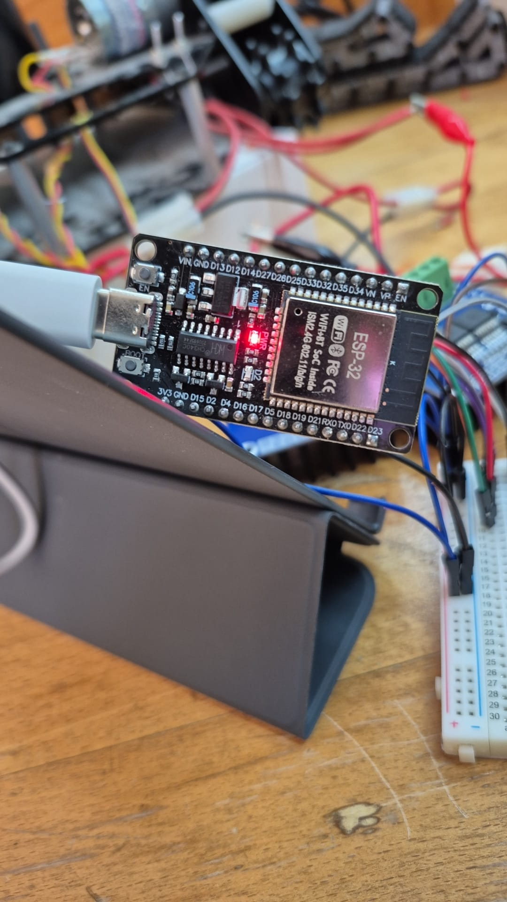

# Wheel Control

The `wheel-control` sketch drives the mascot robot's two wheels from an
**on-screen joystick served by the ESP32 itself**. The board brings up its own
Wi-Fi access point, serves a single page, and that page posts stick positions
back to it about 20 times a second. Each wheel has its own IBT-2 (BTS7960)
H-bridge; the sketch mixes the two axes into a left and a right wheel speed and
writes those speeds out as PWM.

It also knows a handful of **named moves** — `forward`, `spin_right`,
`slight_left` and so on — that one `GET /move` request starts and the board
times by itself, so a tablet app (or a `curl`) can ask for a motion without
streaming stick positions. See section 4.

The sketch is split across seven files, one per concern; section 5 says what
lives where.

There is no physical joystick any more. `R_EN` / `L_EN` are back on GPIOs, so
each wheel's bridge can be gated in hardware from the page — **both wheels come
up disarmed** and stay that way until you turn them on. `R_IS` / `L_IS` are
wired too, as inputs.

Two things stop the robot: the per-wheel enable, and a **link failsafe** that
cuts the drive if no command arrives for 500 ms. See section 9.

## Flashing it

**`wheel-control.ino` is the file you open and upload.** An Arduino sketch's
entry point is the `.ino` named after its folder — there is no `main` or
`index` — and opening it in the Arduino IDE brings the other six files along
as tabs. *Upload* compiles all of them together.

1. Install the ESP32 board package once: *Preferences → Additional Boards
   Manager URLs* → `https://espressif.github.io/arduino-esp32/package_esp32_index.json`,
   then *Tools → Board → Boards Manager* → **esp32**.
2. *File → Open* → `wheel-control/wheel-control.ino`.
3. *Tools → Board* → **DOIT ESP32 DEVKIT V1**; *Tools → Upload Speed* →
   **115200** (the default 921600 fails on this board's USB bridge — see
   *Uploading* at the end); *Tools → Port* → the board.
4. Put the chassis on blocks or leave the motor supply off, then *Upload*.

From a terminal instead, with [`arduino-cli`](https://arduino.github.io/arduino-cli/):

```sh
arduino-cli compile --fqbn esp32:esp32:esp32doit-devkit-v1 wheel-control
arduino-cli upload  --fqbn esp32:esp32:esp32doit-devkit-v1 -p /dev/cu.usbserial-XXXX wheel-control
```

---

## 1. The general idea

The page reports two numbers, each -512 → +512, and sends them to
`GET /drive?x=&y=`. Turning those two numbers into two motor speeds happens in
five steps, in this order:



1. **Deadzone.** Anything within ±60 of centre is forced to 0, and what is left
   is stretched back out over the full range.
2. **Arcade mix.** Y is throttle, X is steering: `left = y + x`,
   `right = y - x`.
3. **Normalise.** The mix can exceed the input range on diagonals, so both
   values are scaled down together rather than clipped.
4. **Map to PWM.** Knob travel becomes a signed PWM value, skipping the low
   band where the motors only buzz.
5. **Slew.** The PWM applied to the wheels moves toward the target by at most
   12 counts per 20 ms loop, so nothing gets a step input.

Sign carries direction all the way through. A positive speed spins a wheel one
way, negative the other, and `driveWheel()` splits the sign off into a direction
just before the hardware write.

The centring and calibration step the old analog stick needed is gone: the
browser sends values that are already centred on 0.

A named move (section 4) is nothing more than a stick position the board writes
for itself and holds for a while, so it enters this same pipeline at the top
and every step applies to it unchanged.

---

## 2. The math

### 2.1 Where x and y come from

The knob is clamped to the circle it sits in. For a base of radius `R` and a
pointer `dx`, `dy` from its centre:

```
d = hypot(dx, dy)
if (d > R) { dx *= R/d;  dy *= R/d }      // clamp to the rim, keep the angle

x =  round(dx / R * 512)
y = -round(dy / R * 512)                  // screen y grows downward, forward is up
```

Two things follow. The clamp is **circular, not square**, so the corners of a
square touch area cannot ask for more than full deflection, and dragging a
finger far off the base still yields a sensible direction. And because the rim
is exactly `R`, full deflection is exactly ±512 — which, unlike the old ADC
path, makes PWM 255 exactly reachable.

The ESP32 clamps both values to ±512 again on arrival. A missing argument reads
as 0, never as the previous value.

### 2.2 Deadzone with rescaling

A touch knob snaps back to exactly centre, so unlike the old potentiometer there
is no drift to reject. The deadzone now does one job: it gives a patch around
centre where small, unintended movements do nothing.

The naive version — "zero it if `|v| <= 60`" — makes speed jump: the moment you
cross 60 the output snaps from 0 to whatever 60 maps to. `applyDeadzone()`
avoids that by remapping the surviving range back onto the full range:

```
|v| <= 60          ->  0
|v| in [60, 512]   ->  sign(v) * (|v| - 60) * 512 / 452
```

So 60 maps to 0, 512 maps to 512, and everything in between is linear. Speed
rises from zero as you leave the deadzone instead of stepping.

The deadzone is 60/512 ≈ 12% of knob travel in each direction. With no analog
drift left to reject you can safely take `DEADZONE` down toward 0 for finer
control near centre.

### 2.3 Arcade mixing

One stick, two wheels. Y is the common-mode term (both wheels the same way) and
X is the differential term (wheels opposed):

```
l = y + x
r = y - x
```

| knob | y | x | l | r | result |
|---|---|---|---|---|---|
| forward | +512 | 0 | +512 | +512 | both wheels forward |
| back | -512 | 0 | -512 | -512 | both wheels back |
| right | 0 | +512 | +512 | -512 | spin in place |
| left | 0 | -512 | -512 | +512 | spin the other way |
| forward-right | +512 | +512 | +1024 | 0 | arc: outside wheel drives, inside stops |

Note the last row. Because both axes reach ±512 independently, the sum can
reach ±1024 — twice what the PWM stage accepts.

(The circular clamp in 2.1 means a real knob cannot reach `x = y = 512` at
once; the true corner is about 362/362. The normalise step below handles both
cases identically.)

### 2.4 Normalising instead of clipping

```
biggest = max(|l|, |r|)
if (biggest > 512) { l = l * 512 / biggest;  r = r * 512 / biggest }
```

Clipping `l` and `r` to ±512 separately would destroy the ratio between them:
`(1024, 512)` would clip to `(512, 512)` and the robot would drive straight
when you asked for a curve. Scaling both by the same factor keeps `l : r`
intact and only reduces overall speed, so the *shape* of the turn survives and
the edges of the knob's travel stay usable.

### 2.5 Knob travel to PWM

A motor under load does nothing below some minimum duty — it just whines. So
`toPwm()` maps magnitude onto `[MIN_PWM, MAX_PWM]` rather than `[0, MAX_PWM]`,
with an explicit zero:

```
v == 0             ->  0
|v| in [1, 512]    ->  sign(v) * (40 + (|v| - 1) * 215 / 511)
```

The output is 0, or 40–255. It is never 1–39, which is the band that produces
noise and heat and no rotation.

### 2.6 Slew limiting

```
leftSpeed  += clamp(targetLeft  - leftSpeed,  -12, +12)
rightSpeed += clamp(targetRight - rightSpeed, -12, +12)
```

`leftSpeed` / `rightSpeed` are the values actually on the pins; the targets are
what the knob is asking for. Moving 12 counts per 20 ms loop means a full
0 → 255 swing takes ⌈255/12⌉ = 22 loops ≈ **0.44 s**. This softens current
spikes, stops the robot tipping on hard throttle, and turns a knob slammed from
full forward to full reverse into a ramp rather than a reversal.

It also means releasing the knob coasts to a stop over ~0.44 s instead of
braking instantly. **The failsafe deliberately bypasses this** — see section 9.

One side effect: `toPwm()` never *targets* the sub-`MIN_PWM` band, but the ramp
passes through it. Starting from rest the pins see 12, 24, 36, then 48, so the
motors spend ~3 loops (~60 ms) below 40 at the start of every move and the end
of every stop — that brief buzz is expected. Raising `SLEW` shortens it.

### 2.7 Inversion

`LEFT_INVERT` and `RIGHT_INVERT` are applied last, on the way to the hardware.
`RIGHT_INVERT` is `-1` because the two motors are mounted facing opposite
directions: "forward" for the chassis is clockwise for one motor and
counter-clockwise for the other. `INVERT_X` / `INVERT_Y` flip the incoming web
axes, applied first — the quickest fix if steering or throttle comes out
backwards and you would rather not edit the page.

### 2.8 Worked example

Knob pushed forward-right, browser sending `x = +300`, `y = +400`. All
arithmetic on the ESP32 is integer, truncating:

| step | left | right |
|---|---|---|
| received | x = +300 | y = +400 |
| deadzone rescale | x = (300-60)·512/452 = **271** | y = (400-60)·512/452 = **385** |
| mix | l = 385+271 = **656** | r = 385-271 = **114** |
| normalise (biggest = 656) | l = 656·512/656 = **512** | r = 114·512/656 = **88** |
| toPwm | 40 + 511·215/511 = **255** | 40 + 87·215/511 = **76** |
| invert | ×1 → **+255** | ×-1 → **-76** |
| hardware | left `RPWM` = 255 | right `LPWM` = 76 |

The left wheel runs flat out, the right wheel crawls: a tight right-hand turn,
with the ratio between the wheels preserved from the mix. Reaching those values
takes ~22 loops of slew.

---

## 3. Wiring

**Board: 30-pin ESP32 DevKit v1** (ESP32-WROOM-32, CH340 USB-serial). Its two
header rows are silkscreened:

```
top     VIN GND D13 D12 D14 D27 D26 D25 D33 D32 D35 D34  VN  VP  EN
bottom  3V3 GND D15  D2  D4 D16 D17  D5 D18 D19 D21 RX0 TX0 D22 D23
```



USB-C at the left-hand end, and the top row running to `D35 D34 VN VP EN` at the
right — the two rows above read left to right in that orientation.

**`VP` and `VN` are GPIO 36 and 39.** They are the chip's two dedicated sense
inputs (ADC1_CH0 and ADC1_CH3) and the only pins on this board not labelled with
their GPIO number — which is why the `IS` rows below give both. The tables use
the silkscreen label as the thing you actually land a wire on.

Pin numbers come straight from the constants in `config.h`.

### Right wheel — IBT-2 / BTS7960

| Driver pin | Board pin | GPIO |
|---|---|---|
| `RPWM` | `D25` | 25 |
| `LPWM` | `D26` | 26 |
| `R_EN` | `D18` | 18 |
| `L_EN` | `D19` | 19 |
| `R_IS` | **`VP`** | 36 |
| `L_IS` | **`VN`** | 39 |

### Left wheel — IBT-2 / BTS7960

| Driver pin | Board pin | GPIO |
|---|---|---|
| `RPWM` | `D32` | 32 |
| `LPWM` | `D33` | 33 |
| `R_EN` | `D21` | 21 |
| `L_EN` | `D22` | 22 |
| `R_IS` | `D34` | 34 |
| `L_IS` | `D35` | 35 |

Twelve signals plus power. Plus the rest of the IBT-2 hookup: driver
`VCC`/`GND` to **3V3**/GND, motor supply to `B+`/`B-`, and a common ground
between the motor supply and the ESP32.

**Run the driver's `VCC` from the ESP32's `3V3` pin, not 5V.** The IBT-2's logic
pins go through a buffer powered from `VCC`; at `VCC` = 5 V that buffer wants
~3.5 V to see a HIGH, and the ESP32 only drives 3.3 V — marginal at best, dead
at worst. At `VCC` = 3.3 V the threshold drops to ~2.3 V and 3.3 V logic is
comfortably above it. `B+`/`B-` still carry the full motor supply; only the
logic side moves to 3.3 V, and `R_EN`/`L_EN` follow `VCC` down with it.

**`R_EN` and `L_EN` are driven, not strapped.** Both halves of a bridge move
together, and both start LOW, so the drivers are gated off before anything else
in `setup()` runs. `enableWheel()` is the only function that touches them.

**`R_IS` and `L_IS` are `INPUT`, never driven.** They are the BTS7960's own
current-sense *outputs* — configuring the ESP32 as an output on the same net
puts two drivers on one wire. The sketch does not read them yet; they sit on
GPIO 34–39, which is input-only and on ADC1, so `analogRead()` on them would
keep working with Wi-Fi up if you want current sensing later.

**Still free on this board:** `D27`, `D23`, `D17`, `D16`, `D14`, `D13`, `D12`,
`D5`, `D4`, `D15`, `D2`. Avoid `D15`/`D2` (strapping) and `RX0`/`TX0` (the USB
serial console) unless you have no choice. `D27` held the old thumbstick's `SW`;
`D34`/`D35` held `VRx`/`VRy` and the `IS` lines now use them.

### ESP32 pin constraints

Any output-capable GPIO can do PWM here — `analogWrite()` on arduino-esp32 ≥ 2.0
is backed by the LEDC peripheral (8-bit, ~1 kHz), so there is no "PWM pin" list
to respect the way there is on an ATmega. The constraints that *do* bite if you
move the four PWM pins:

- **GPIO 34–39 are input-only.** They cannot drive a driver input at all.
- **Avoid GPIO 0, 2, 12 and 15** (strapping pins — a driver holding one at the
  wrong level at reset changes the boot mode), **6–11** (flash), and **1/3**
  (UART0, the serial monitor).
- **Anything else is fair game.** GPIO 25/26 double as the DACs and 32/33 as
  ADC1 inputs, but nothing here uses either function.

---

## 4. Web control

### Connecting

The ESP32 runs as an **access point** — it makes its own network rather than
joining yours. Nothing else is needed: no router, no app, no filesystem upload.

1. Power the board.
2. Join the Wi-Fi network **`mascot-robot`**, password **`mascotbot`**.
3. Open **`http://192.168.4.1`**.

The IP is printed to serial at 115200 baud on boot as well. Your phone has no
internet while it is on this network, which is why the page loads no fonts,
frameworks or icons from anywhere — it is one self-contained ~6 KB document
compiled into the sketch as a `PROGMEM` string (`page.h`) and served with
`send_P()`.

**Change the SSID and password** in `config.h`:

```c
const char *AP_SSID = "mascot-robot";
const char *AP_PASS = "mascotbot";
```

WPA2 needs **8 characters or more**. With a shorter one `softAP()` quietly
brings the network up with no password at all, so anyone in range can drive the
robot. It does not warn you.

### The page

A round base with a draggable knob, built on Pointer Events so one code path
covers finger, stylus and mouse. `setPointerCapture()` keeps the drag alive when
your finger leaves the base, and `touch-action: none` stops the browser from
scrolling or pinch-zooming the page out from under you.

Under the knob, three readouts:

| Readout | Meaning |
|---|---|
| `link` | green `linked` once a request succeeds, red `no link` the moment one fails or exceeds its 250 ms timeout |
| `axes` | what the knob is asking for, -512 → +512 |
| `wheels` | the signed PWM actually on the pins, read back from the ESP32's reply |

Below the readouts, **LEFT** and **RIGHT** arm each wheel independently — green
`ON`, grey `OFF`. They drive that wheel's two `EN` pins, so a disarmed wheel is
dead in hardware, not just commanded to zero. Both start `OFF` after every boot.

Plus a **STOP** button, which centres the knob and calls `/stop`. STOP does not
disarm; it zeroes the axes and leaves the enables as you set them.

### The HTTP API

| Route | Returns | Purpose |
|---|---|---|
| `GET /` | the page, `text/html` | what the browser loads |
| `GET /drive?x=<-512..512>&y=<-512..512>` | status | one control command, and the heartbeat that keeps the failsafe fed. Anything other than `0,0` also cancels a running move |
| `GET /enable?l=<0\|1>&r=<0\|1>` | status | arms or disarms either wheel; an omitted argument leaves that wheel alone |
| `GET /stop` | status | zeroes both axes immediately, and cancels a running move |
| `GET /move?name=<move>&ms=<hold>&speed=<0..100>` | status, or 400 | starts a named move on the board's own clock — see *Named moves* below |
| `GET /moves` | the move names, comma-separated | what `/move` accepts, so a client need not hard-code the list |
| anything else | 404 `not found` | |

Every control route answers with the same one-line **status**:

```
<leftSpeed>,<rightSpeed>,<leftEnabled>,<rightEnabled>
```

e.g. `254,-76,1,0`. The board is the authority on all four, so the readouts and
the arm buttons track it no matter which request came back last — which is also
what keeps two phones on the same page consistent, and what restores the buttons
correctly after a reload. `/drive` arguments are clamped server-side.

You can drive the robot from the command line with the same API:

```sh
curl "http://192.168.4.1/enable?l=1&r=1"    # arm both wheels
curl "http://192.168.4.1/drive?x=0&y=400"   # forward
curl "http://192.168.4.1/stop"
curl "http://192.168.4.1/enable?l=0&r=0"    # disarm
```

Remember the failsafe: a single `curl` drives for 500 ms and then cuts out. To
keep moving you have to keep sending — or ask for a named move.

### Named moves

`GET /move?name=<move>` asks the board to hold a stick position on its own
clock, so a client can say *spin right for a second* in one request instead of
streaming `/drive` commands. The names come from the `MOVES[]` table in
`moves.ino`, and `GET /moves` returns them:

| move | x | y | what the robot does |
|---|---|---|---|
| `forward` | 0 | +512 | both wheels forward |
| `backward` | 0 | -512 | both wheels back |
| `spin_left` | -512 | 0 | wheels opposed: turns on the spot |
| `spin_right` | +512 | 0 | turns on the spot the other way |
| `turn_left` | -360 | +512 | tight turn: the inside wheel nearly stops |
| `turn_right` | +360 | +512 | |
| `slight_left` | -150 | +512 | gentle arc: both wheels still driving |
| `slight_right` | +150 | +512 | |
| `stop` | 0 | 0 | centres the stick and holds it there |

`x` and `y` are stick positions in the same frame the page sends, so a move
goes through the whole of section 2 exactly as a knob would — inversion,
deadzone, mix, normalise, PWM, slew — and the per-wheel enables still gate it:
**a disarmed wheel does not move for a move either.**

Two optional arguments:

| argument | default | meaning |
|---|---|---|
| `ms` | `MOVE_DEFAULT_MS` = 500 | how long to hold the stick, in ms. **Capped at `MOVE_MAX_MS` = 3000** whatever you ask for — section 9 says why |
| `speed` | 100 | percent of full deflection. It scales the stick, not the PWM, so anything below about 12 % lands inside the deadzone (section 2.2) and does nothing |

```sh
curl "http://192.168.4.1/enable?l=1&r=1"                # arm both wheels
curl "http://192.168.4.1/move?name=spin_right&ms=1000"  # one second on the spot
curl "http://192.168.4.1/move?name=forward&speed=50"    # 500 ms at half deflection
curl "http://192.168.4.1/moves"                         # forward,backward,spin_left,...
curl "http://192.168.4.1/move?name=sideways"            # 400: unknown move "sideways", try one of: ...
```

When the hold ends the stick is centred and the wheels ramp down through slew,
exactly like a released knob. Until then:

- a new `/move` replaces the running one;
- `/stop` cancels it;
- a **deflected** knob cancels it — any `/drive` other than `0,0` — because
  whoever is holding the phone should always win. A `/drive` of `0,0` does
  *not*: that is the page's idle heartbeat, sent at 5 Hz whenever the page is
  open, and it would otherwise kill every move within 200 ms of a phone being
  connected;
- disarming a wheel stops that wheel, as always.

Add a move by adding a row to `MOVES[]` in `moves.ino`. Nothing else needs to
change — `/moves` and the 400 message read the table.

### Timing

| | rate | set by |
|---|---|---|
| knob held | one request per 50 ms tick (20 Hz) | `TICK_MS` |
| knob idle | one heartbeat per 200 ms (5 Hz) | `IDLE_TICKS` × `TICK_MS` |
| after release | 3 zero commands, then back to idle | `burst` |
| per-request timeout | 250 ms, via `AbortController` | inline |

`TICK_MS` and `IDLE_TICKS` are the first two lines of the page's script.

Exactly **one request is in flight at a time**. Pointer events fire at 60–120 Hz;
a fixed 50 ms tick reads the latest knob position rather than sending on every
move, and the in-flight guard means a slow reply delays the next command instead
of queueing a backlog of stale ones behind it.

The release burst matters: the failsafe is the backstop for a *dropped* link,
but letting go of the knob should stop the robot immediately, so the zero is
sent three times rather than trusting one packet. It counts **sends, not ticks**
— a tick that is skipped because the previous request has not come back yet does
not consume one of the three.

### Why polling and not WebSockets

`WebServer.h` ships with the ESP32 core; a WebSocket server does not. Polling
over plain HTTP keeps the sketch on stock libraries, so it compiles on a fresh
install with nothing to add. That is the whole reason, and it has a real cost
worth knowing about.

The bundled `WebServer` handles **one connection at a time**, and it does not
keep them alive — the keep-alive branch in `handleClient()` is commented out in
the core (a long-standing Chrome workaround, espressif/arduino-esp32#3652). So
every request opens and closes its own TCP connection: at 20 Hz that is 20
connections a second cycling through a small pool of lwIP control blocks. It
drives fine; it is simply not free, and it is the first thing that will degrade
over a long session.

One stall is worth knowing about too. If something opens a connection and then
sends no request on it — browsers do this speculatively — `handleClient()` holds
that single slot for up to `HTTP_MAX_DATA_WAIT` (5 s in the core) and serves
nobody else meanwhile. The failsafe cuts the motors well before that, so the
symptom is a freeze, not a runaway.

If either bites, in order of effort: raise `TICK_MS` in the page to 100 — 10 Hz
is still perfectly drivable — or install a WebSocket library and replace the
polling with one persistent connection.

---

## 5. Program structure

### The files

The sketch is one folder, and the Arduino IDE shows each file in it as a tab:

| File | Holds |
|---|---|
| `wheel-control.ino` | The globals every tab shares, `setup()`, `loop()`, `failsafe()`, `report()` |
| `config.h` | Pins, tuning constants, Wi-Fi credentials, safety limits — **the only file you should need to edit** |
| `mixing.ino` | The math of section 2: `applyDeadzone()`, `arcadeMix()`, `toPwm()`, `slew()`. Pure functions |
| `moves.ino` | The `MOVES[]` table and the functions that start, time and cancel a move |
| `web.ino` | `startAccessPoint()`, `startServer()`, every route handler, `statusBody()` |
| `page.h` | `INDEX_HTML`, the control page. Included only by `web.ino` |
| `wheels.ino` | Everything that touches a pin: `setup*Wheel()`, `enableWheel()`, `driveWheel()`, `rotateWheel()`, `stopWheels()` |

There is no build system and nothing to configure: every `.ino` in the folder
is compiled **as one file** — the one named after the folder first, the rest
in alphabetical order — with a prototype for every function inserted near the
top of the main file, which is what lets the tabs call each other in any
order. Two rules follow from that, and both show up as compile errors if
ignored:

1. **A global that more than one tab uses is defined in `wheel-control.ino`.**
   A function cannot use a variable defined further down the combined file,
   and "further down" means a tab that sorts later alphabetically, which has
   nothing to do with what makes sense. A tab may keep state that only its own
   functions touch (`moveUntil` in `moves.ino`), because those functions come
   after it in the same file.
2. **No struct of our own in a function signature.** The generated prototypes
   land above every tab, so a `Move` in a parameter list would be named before
   it is defined. `findMove()` returns an index for that reason.

`.h` files are ordinary C++ headers and follow ordinary rules: `config.h`
*defines* its variables, so it carries `#pragma once` and is included exactly
once, from the main file.

### `setup()`

Runs once, in this order, and the order is deliberate:

1. `Serial.begin(115200)` — the ESP32 boot ROM's own baud, so the monitor is
   not garbage through the boot messages.
2. `setupRightWheel()` / `setupLeftWheel()` — PWM and `EN` pins to `OUTPUT`
   with **every `EN` LOW**, and the four `IS` pins to `INPUT`. The bridges are
   gated off here, before anything else can happen.
3. `stopWheels()` — all four PWM pins to 0, **before the radio powers up**, so
   the Wi-Fi start-up current surge cannot find a driver input mid-write.
4. `enableWheel('R', START_ENABLED)` / `enableWheel('L', …)` — `EN` is already
   LOW from step 2; this makes the disarmed state explicit and sets the flags
   the page reads back.
5. `startAccessPoint()` — `WIFI_AP` mode, `softAP()`, print the IP.
6. `startServer()` — register the routes, `enableDelay(false)`, `begin()`.
7. Ready message.

`enableDelay(false)` matters: by default `handleClient()` sleeps 1 ms on an idle
call, which would jitter the control loop that shares the same task.

### `loop()`

No `delay()` anywhere — the loop runs flat out serving HTTP and gates the
control step on `millis()`:

```
server.handleClient()            every pass, as fast as possible

if (millis() - lastStep < LOOP_MS) return
lastStep = millis()

serviceMove()                    a running move stamps lastCommand itself,
                                 so this comes before the check -- section 9

if (millis() - lastCommand > COMMAND_TIMEOUT_MS) { failsafe(); return }

applyDeadzone -> x, y
arcadeMix     -> l, r, mixed then normalised so |l|, |r| <= 512
toPwm         -> targetLeft, targetRight   (0 for a disarmed wheel)
slew          -> leftSpeed, rightSpeed
driveWheel    -> hardware, with LEFT_INVERT / RIGHT_INVERT applied
report        -> serial, rate-limited
```

`LOOP_MS` sets the control rate, and `SLEW` is defined per loop, so the two
constants together determine the acceleration ramp. Changing one changes the
ramp.

Every route handler runs from inside `handleClient()`, on the same task as
`loop()` — so `webX`, `webY`, `lastCommand`, `moveUntil` and the enable flags
need no locking and no `volatile`.

---

## 6. Constants

All in `config.h`.

| Name | Value | Meaning |
|---|---|---|
| `AP_SSID` | `"mascot-robot"` | Network the board creates. |
| `AP_PASS` | `"mascotbot"` | **Change it.** 8 characters minimum or the network comes up open. |
| `COMMAND_TIMEOUT_MS` | 500 | Silence after which the drive is cut. Section 9. |
| `START_ENABLED` | `false` | Arm state at boot. `false` means a reset or a fresh upload cannot drive anything until you tap a wheel on. Set `true` for the old always-live behaviour. |
| `MOVE_DEFAULT_MS` | 500 | How long `/move` holds the stick when the request gives no `ms`. |
| `MOVE_MAX_MS` | 3000 | The longest any `/move` can hold, whatever it asks for. The link failsafe is suspended for the length of a move, so this is the bound on unattended driving — section 9. |
| `DEADZONE` | 60 | Counts either side of centre treated as neutral. Safe to lower toward 0 now that the input is digital. |
| `MIN_PWM` | 40 | Lowest PWM that actually turns a loaded motor. Raise if the robot stalls and buzzes at low throttle; lower if it lurches off the deadzone. |
| `MAX_PWM` | 255 | Full duty. Lower it to cap top speed. |
| `SLEW` | 12 | Max PWM change per loop. Lower = gentler and slower to respond; higher = snappier and harder on the battery. |
| `LOOP_MS` | 20 | Control-step period, ~50 Hz. |
| `LEFT_INVERT` | 1 | Flip to -1 if the left wheel runs backwards. |
| `RIGHT_INVERT` | -1 | Already -1 for the mirrored motor mounting. |
| `INVERT_X` | 1 | Flip to -1 if steering is reversed. |
| `INVERT_Y` | 1 | Flip to -1 if throttle is reversed. |

## 7. Globals

In `wheel-control.ino` unless the row says otherwise.

| Name | Type | Meaning |
|---|---|---|
| `server` | `WebServer` | The HTTP server, on port 80. |
| `INDEX_HTML` | `const char[] PROGMEM` | The whole control page. In `page.h`. |
| `webX`, `webY` | `int` | Last commanded axes, -512 → +512. Written by `handleDrive()`. |
| `lastCommand` | `unsigned long` | `millis()` of the last `/drive`, `/stop` or `/move` — or of the last control step while a move runs. The failsafe measures against this. |
| `lastStep` | `unsigned long` | `millis()` of the last control step, for the `LOOP_MS` gate. |
| `leftSpeed`, `rightSpeed` | `int` | Signed PWM currently applied, -255 → 255. Persist across loops — slew needs the previous value. |
| `leftEnabled`, `rightEnabled` | `bool` | Whether each bridge's `EN` pins are HIGH. Written only by `enableWheel()`. |
| `lastPrint` | `unsigned long` | `millis()` of the last serial report, for rate limiting. |
| `MOVES`, `MOVE_COUNT` | `const Move[]`, `const int` | The move table — name, x, y — and its length. In `moves.ino`. |
| `moveUntil` | `unsigned long` | `millis()` at which the running move stops holding the stick; 0 when none is running. In `moves.ino`, touched only by its own functions. |

## 8. Functions

| Tab | Function | Does |
|---|---|---|
| `main` | `setup()` | Boot sequence, section 5. |
| `main` | `loop()` | HTTP service plus one gated control step, section 5. |
| `web` | `startAccessPoint()` | `WIFI_AP` mode, `softAP(AP_SSID, AP_PASS)`, prints the IP. Says so on serial and returns if the AP fails to come up, rather than printing `0.0.0.0`. |
| `web` | `startServer()` | Registers `/`, `/drive`, `/enable`, `/stop`, `/move`, `/moves` and the 404, disables `handleClient()`'s idle delay, starts listening. |
| `web` | `statusBody()` | Builds the `L,R,leftEnabled,rightEnabled` line every control route replies with. |
| `wheels` | `enableWheel(char wheel, bool on)` | The only function that touches `EN`. Zeroes that wheel's PWM and stored speed **first**, then moves both `EN` pins together, so neither edge hands the driver a live duty cycle. |
| `web` | `handleRoot()` | `send_P()` of `INDEX_HTML` straight out of flash. |
| `web` | `handleDrive()` | Clamps `x` and `y` to ±512 into `webX`/`webY`, stamps `lastCommand`, replies with the status line. A missing argument reads as 0. Anything other than `0,0` cancels a running move; `0,0` — the page's idle heartbeat — leaves it alone and does not touch the stick. |
| `web` | `handleEnable()` | Arms/disarms from `l` and `r` arguments. An absent argument leaves that wheel alone, so one button cannot disarm the other by omission. |
| `web` | `handleStop()` | Cancels any move, zeroes both axes and stamps `lastCommand`. Does not change the enables. |
| `web` | `handleMove()` | Reads `name`, `ms` and `speed`, hands them to `startMove()`, replies with the status line — or 400 and the list of names if the move does not exist. |
| `web` | `handleMoves()` | Replies with `listMoves()`. |
| `web` | `handleNotFound()` | 404. |
| `main` | `failsafe()` | Zeroes the axes **and the applied speeds**, then `stopWheels()` — no slew ramp. Returns early when already stopped, so it neither re-writes the pins nor spams serial. |
| `mixing` | `applyDeadzone(int v)` | Axis value → 0 inside the deadzone, otherwise rescaled to the full ±512 range. Section 2.2. |
| `mixing` | `arcadeMix(int x, int y, long &l, long &r)` | `l = y + x`, `r = y - x`, then both scaled down together if either exceeds 512. Sections 2.3 and 2.4. |
| `mixing` | `toPwm(long v)` | Mixed value (±512) → signed PWM, 0 or ±40…255. Section 2.5. |
| `mixing` | `slew(int current, int target)` | Returns `current` moved toward `target` by at most `SLEW`. Section 2.6. |
| `main` | `report(int x, int y)` | Prints `x`, `y`, `L`, `R` to serial at most every 250 ms. Returns immediately otherwise, so it never stalls the loop. |
| `moves` | `findMove(const String &name)` | Index of a name in `MOVES[]`, or -1. Case-sensitive. |
| `moves` | `startMove(const String &name, long ms, int speed)` | Writes the move's stick position, scaled by `speed`, into `webX`/`webY`; stamps `lastCommand`; sets `moveUntil`. `ms <= 0` means `MOVE_DEFAULT_MS`, and **the hold is capped at `MOVE_MAX_MS` here**, not in the route, so every caller gets the cap. Returns `false` for an unknown name and then changes nothing. |
| `moves` | `serviceMove(unsigned long now)` | One call per control step, before the failsafe check. While the hold lasts, stamps `lastCommand`. When it ends, centres the stick and keeps stamping until both wheels are at rest, so the ramp-down is never mistaken for a lost link. Then clears `moveUntil`. |
| `moves` | `cancelMove()` | Clears `moveUntil`. Does not touch the stick — the caller decides what happens next. |
| `moves` | `moveRunning()` | Whether `moveUntil` is set. |
| `moves` | `listMoves()` | The names in `MOVES[]`, comma-separated. |
| `wheels` | `driveWheel(char wheel, int speed)` | Splits a signed speed into a direction (+1/-1/0) and a magnitude, then calls `rotateWheel()`. |
| `wheels` | `rotateWheel(char wheel, int dir, int speed)` | The only function that touches the PWM pins. Picks the wheel's pin pair, clamps speed to 0–255, and writes them. |
| `wheels` | `stopWheels()` | `rotateWheel(..., 0, 0)` on both wheels — all four PWM pins to 0. Does not touch `EN`; that is `enableWheel()`'s job. |
| `wheels` | `setupLeftWheel()`, `setupRightWheel()` | One driver's pins: PWM and `EN` to `OUTPUT` with `EN` LOW, `IS` to `INPUT`. |

### On `rotateWheel()`

A BTS7960 must never see both `RPWM` and `LPWM` driven at once — that is
shoot-through, and it is how the driver dies. The write order enforces it:

```c
if (dir >= 0) analogWrite(lPin, 0);     // clear the idle half first
if (dir <= 0) analogWrite(rPin, 0);
if (dir ==  1) analogWrite(rPin, speed);  // only then raise the active one
if (dir == -1) analogWrite(lPin, speed);
```

The pin coming down is always written before the pin going up, and `dir == 0`
takes both branches, which zeroes both pins. Keep that ordering if you touch
this function.

---

## 9. Safety

Control travels over a radio link, which can simply stop. Three things cover
that now — the per-wheel enable, the link failsafe, and the boot ordering — and
one window is still outside software's reach.

### The link failsafe

Every `/drive`, `/stop` and `/move` stamps `lastCommand`. If a control step finds more
than `COMMAND_TIMEOUT_MS` (500 ms) of silence, `failsafe()` runs: both axes to
0, both applied speeds to 0, `stopWheels()`, done.

It **bypasses `slew()` on purpose.** Ramping down from full speed takes 22 loops
≈ 0.44 s, which on top of the 500 ms timeout would mean nearly a full second of
a robot driving somewhere you are no longer steering it. Cutting outright costs
a harder stop and buys back that 0.44 s:

| | time from link loss to wheels stopped |
|---|---|
| cut outright (what it does) | ~0.5 s |
| ramped down through `slew()` | ~0.94 s |

Letting go of the knob normally still ramps down — the failsafe path only fires
when the link itself has gone quiet.

It deliberately does **not** drop `EN`. Arming is your explicit choice and the
robot should not silently re-arm itself when the link returns. Leaving `EN` high
with 0 duty also turns both low-side FETs on, which brakes the motors; dropping
`EN` would let them coast. For a robot you have lost contact with, braking is
what you want.

The browser's 5 Hz idle heartbeat is what keeps the failsafe fed while you are
connected but not driving. That means closing the tab, locking the phone or
walking out of range all stop the robot within half a second.

### Moves and the failsafe

A named move is the one case where the board drives with nobody sending
commands. For the length of the hold `serviceMove()` stamps `lastCommand`
itself, every control step — otherwise the failsafe above would cut every move
at 500 ms. That suspends the link failsafe on purpose, and three things bound
what it can do:

- **`MOVE_MAX_MS` caps the hold** at 3 s whatever the request asked for. The
  cap is applied in `startMove()`, not in the route handler, so any future
  caller gets it too. A client that dies mid-move has a robot that stops
  within 3 s plus the slew ramp, and its wheels never re-arm on their own.
- **The enables still gate it.** A move is a stick position and nothing more;
  a disarmed wheel is dead in hardware for a move exactly as for the knob.
- **Whoever is holding the phone wins.** A deflected knob or `/stop` cancels
  the move at once.

When the hold ends the stick is centred and the wheels ramp down through
`slew()` — a designed stop, so the stamping continues until both wheels are at
rest and the failsafe never mistakes the ramp for a lost link, whatever `SLEW`
is set to. Only then does `lastCommand` go stale, and the failsafe that fires
500 ms later finds nothing to cut.

Raise `MOVE_MAX_MS` only if you understand that it is the *whole* of the
protection while a move runs.

### The per-wheel enable

Each wheel's two `EN` pins are driven together by `enableWheel()` and start LOW,
so the bridges are gated off in hardware before `setup()` does anything else. A
disarmed wheel is not "commanded to zero" — the driver itself is off, and no
value on `RPWM`/`LPWM` can move it.

`START_ENABLED` is `false`, so a reset or a fresh upload lands disarmed every
time. That is the behaviour worth keeping: the old build went live the instant
it booted.

Arming order matters and the code enforces it. `enableWheel()` zeroes the PWM
and the stored speed *before* moving `EN`, on both edges, so arming cannot
resume at whatever the wheel was last doing and disarming cannot strand a live
duty cycle on a bridge that is about to come back.

### The window software cannot reach

Between power-on and the first line of `setup()`, the ESP32's GPIOs float or are
pulled by the bootloader — and that now includes the `EN` pins. If the drivers
have power during a reset or a flash, a floating `EN` can enable a bridge before
any code runs.

**Fit ~10 kΩ pulldowns on the four `EN` lines.** That is the one hardware change
that closes this, and it is more useful than pulling down `RPWM`/`LPWM`: `EN`
low holds the bridge off regardless of what the PWM pins are doing. Without them
the enables are undefined for the first few hundred milliseconds of every boot.

`WiFi.softAP()` also draws a large current spike; `stopWheels()` and both
`enableWheel()` calls deliberately run before it, so every driver input is at a
defined level before the radio starts.

Regardless:

- Put the chassis on blocks before uploading, or leave the motor supply off.
- Keep a physical cutoff on the motor supply within reach — it is still the only
  true kill switch.

### The network

An open access point means anyone in range can drive the robot. Set a real
`AP_PASS`, and remember the 8-character minimum — below that the network comes
up with no password and no warning.

## 10. Tuning checklist

| Symptom | Fix |
|---|---|
| Page will not load | Check you joined `mascot-robot` and not your normal Wi-Fi; the address is `http://192.168.4.1`, with `http://`, not a search. |
| Network appears but takes no password | `AP_PASS` is shorter than 8 characters, so WPA2 was skipped. |
| `link` goes red while driving | Out of range, phone slept, or the tab lost focus. The robot has already stopped. |
| `link` flickers red over a long session | Per-request TCP churn — see section 4. Raise `TICK_MS` to 100. |
| Android keeps offering to switch networks | The AP has no internet, so Android wants to leave it. Tell it to stay connected, or Android may drop you mid-drive. iOS just shows "No Internet Connection" and stays. |
| Serial says `softAP() failed` | The radio did not come up at all. Power-cycle; check the board is not brownout-resetting off the motor supply. |
| Robot stutters — drives, stops, drives | Link is dropping past 500 ms. Move closer; raise `COMMAND_TIMEOUT_MS` only if you understand section 9. |
| Robot keeps moving after you let go | Should be impossible — release sends three zeros and the failsafe is the backstop. Check serial for `link lost -- motors cut`. |
| Push the knob and one wheel does nothing | That wheel is disarmed. Tap `LEFT`/`RIGHT` until it reads `ON`. |
| Neither wheel moves after a reset | Expected — `START_ENABLED` is `false`, so every boot lands disarmed. Arm them, or flip the constant. |
| Buttons show `ON` but the wheel is dead | `EN` wiring: `D18`/`D19` to the right driver, `D21`/`D22` to the left, both halves of a bridge connected. |
| Cannot find pin "36" or "39" on the board | They are silkscreened **`VP`** and **`VN`**, on the top row next to `EN`. |
| Motors twitch during upload or reset | `EN` is floating before `setup()` runs. Fit ~10 kΩ pulldowns on `D18`/`D19`/`D21`/`D22` — see section 9. |
| Robot creeps with the knob centred | Raise `DEADZONE`. |
| Buzzes but will not move at low throttle | Raise `MIN_PWM`. |
| Lurches as soon as it leaves the deadzone | Lower `MIN_PWM`. |
| One wheel runs backwards | Flip that wheel's `*_INVERT`. |
| Both wheels backwards | Flip `INVERT_Y`. |
| Steering reversed | Flip `INVERT_X`. |
| Nothing moves at all, or only sometimes | 3.3 V logic into a 5 V-powered driver — see section 3. |
| Only full speed or nothing | Check the PWM pins are output-capable GPIOs (not 34–39) — see section 3. |
| Too twitchy | Lower `SLEW`. |
| Too sluggish to respond | Raise `SLEW`. |
| Too fast overall | Lower `MAX_PWM`. |
| `/move` answers 400 | The name is not in `MOVES[]`. Names are case-sensitive; `GET /moves` lists them. |
| A move does nothing | The wheels are disarmed — arm them first, a move respects the enables. Or `speed` is so low the stick lands inside the deadzone. |
| A move stops early | Someone's knob was deflected, or `/stop` was called — both cancel a move. Or the hold hit `MOVE_MAX_MS`. |
| A move never lasts as long as asked | `ms` is capped at `MOVE_MAX_MS` (3000). Section 9 says why. |

### Uploading

| Symptom | Fix |
|---|---|
| `Unable to verify flash chip connection` right after `Changing baud rate to 921600` | **Tools → Upload Speed → 115200.** The chip and flash are fine; the USB-serial bridge cannot hold 921600. This is the default for this board, so it bites on a fresh install. |
| Upload fails, board keeps running the *previous* sketch | Same thing — a failed upload leaves the old firmware in place. Press EN and read the first serial line to see what is actually on the chip: `access point "mascot-robot" up…` is this sketch, anything else is not. |
| `Serial port busy` / flaky uploads | Close the Serial Monitor first. The IDE usually releases the port on its own, but a stuck `serial-monitor` helper will hold it. |
| Fails at any speed | Try another USB cable (many are charge-only), plug straight into the machine rather than a hub, and unplug the drivers' `VCC` while flashing — peripherals loading 3V3 cause the same error. |

After a successful upload the sketch prints two lines and then goes **quiet**:

```
access point "mascot-robot" up, open http://192.168.4.1
Mascot robot ready.
```

That silence is correct. `report()` only runs on the live control path, and with
no browser connected every loop takes the failsafe branch. Serial traffic starts
when you load the page, or when a `/move` arrives — each one logs a line like
`move: spin_right for 1000 ms at 100%` as it starts.
